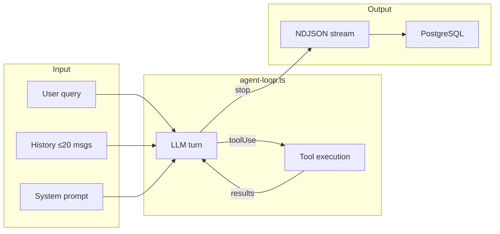
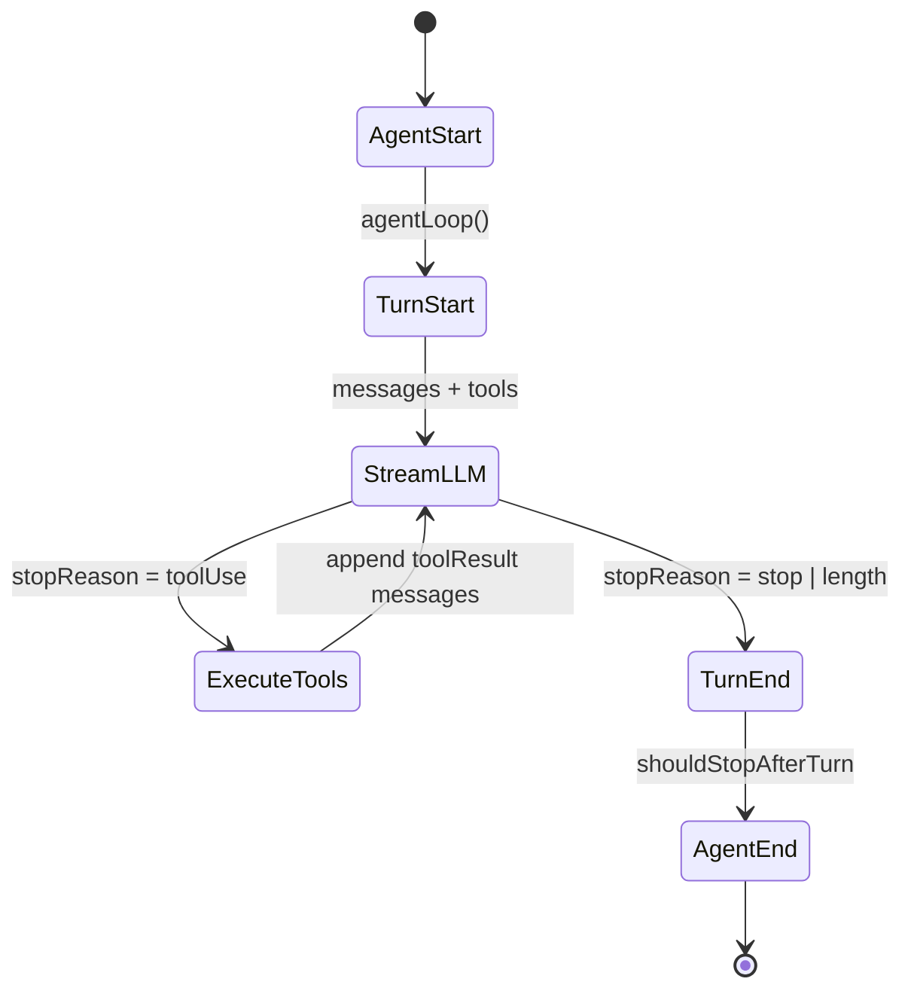
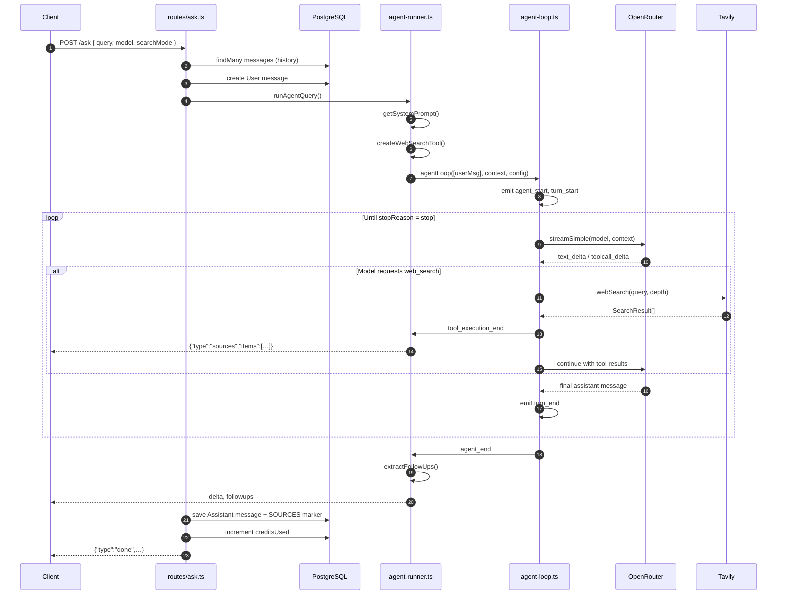
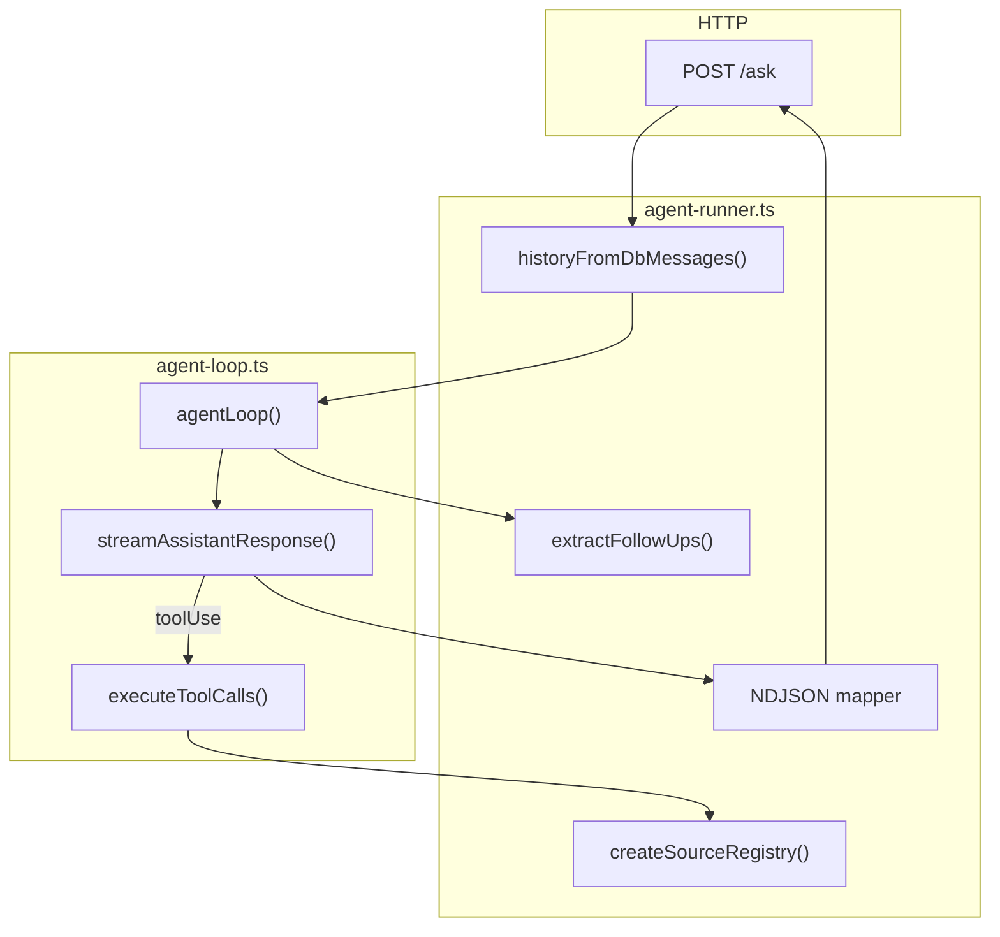
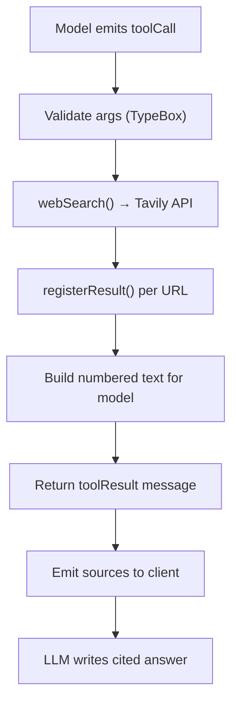

# Agent Loop

> Internal architecture of the Lumina agent — from HTTP request to streamed, cited answer.

← [Project README](../README.md) · [Deployment](DEPLOY.md)

---

## Table of contents

1. [Overview](#overview)
2. [End-to-end sequence](#end-to-end-sequence)
3. [Layer responsibilities](#layer-responsibilities)
4. [The loop (`agent-loop.ts`)](#the-loop-agent-loopts)
5. [The runner (`agent-runner.ts`)](#the-runner-agent-runnerts)
6. [Prompt system](#prompt-system)
7. [`web_search` tool](#web_search-tool)
8. [Source registry](#source-registry)
9. [NDJSON event mapping](#ndjson-event-mapping)
10. [History & persistence](#history--persistence)
11. [Configuration](#configuration)
12. [Errors & testing](#errors--testing)

---

## Overview

The agent follows a **tool-first** pattern: the LLM receives a system prompt, conversation history, and a `web_search` tool definition. It decides whether to search or answer from context.



### State machine



---

## End-to-end sequence



---

## Layer responsibilities

| Layer | File | Responsibility |
|-------|------|----------------|
| **Route** | `routes/ask.ts` | Auth, credits, DB I/O, NDJSON writer |
| **Runner** | `agent/agent-runner.ts` | Prompt, tools, source registry, event mapping |
| **Loop** | `agent/agent-loop.ts` | Generic turn/tool cycle (pi-ai) |
| **Tool** | `tools/web-search.ts` | Tavily search, numbered results |
| **Search** | `search/search.ts` | Tavily client wrapper |
| **Prompt** | `prompts/prompt.md` + `prompt-loader.ts` | System instructions |
| **Stream** | `agent/stream-fn.ts` | OpenRouter provider via pi-ai |



---

## The loop (`agent-loop.ts`)

Built on `@earendil-works/pi-ai`. Handles streaming, tool validation, and multi-turn execution.

### Entry points

```typescript
// New user message(s)
agentLoop(prompts, context, config, signal, streamFn)

// Continue from existing context (retries)
agentLoopContinue(context, config, signal, streamFn)
```

### Pseudocode

```
emit agent_start

repeat outer:
  repeat inner:
    emit turn_start
    inject pending steering messages (if any)

    assistant = streamAssistantResponse(context)
      → transformContext? (optional)
      → convertToLlm(messages)     // AgentMessage[] → Message[]
      → streamFn(model, { systemPrompt, messages, tools })

    if assistant.stopReason in (error, aborted) → return

    toolCalls = assistant.content.filter(type === "toolCall")
    if toolCalls:
      if stopReason === "length":
        fail all calls (truncated args unsafe)
      else:
        execute tools → append toolResult messages

    emit turn_end
    if shouldStopAfterTurn → return

  if followUpMessages → continue outer
  else break

emit agent_end
```

### Streaming boundary

```typescript
// agent-loop.ts — LLM call setup
const llmMessages = await config.convertToLlm(messages);
const llmContext: Context = {
  systemPrompt: context.systemPrompt,
  messages: llmMessages,
  tools: context.tools,
};
const response = await streamFn(config.model, llmContext, { apiKey, signal });
```

Stream events forwarded to the runner:

| pi-ai event | Mapped to |
|-------------|-----------|
| `text_delta` | `delta` (client) |
| `thinking_delta` | `thinking` (client) |
| `toolcall_*` | internal only |
| `tool_execution_start/end` | `tool_start` / `tool_end` |

### Stop condition

```typescript
// agent-runner.ts
shouldStopAfterTurn: ({ message }) =>
  message.stopReason === "stop" || message.stopReason === "length",
```

The loop exits when the model produces a final text answer (not `toolUse`).

---

## The runner (`agent-runner.ts`)

Lumina-specific wiring on top of the generic loop.

### Context assembly

```typescript
const registry = createSourceRegistry();
const webSearchTool = createWebSearchTool(searchDepth, registry.registerResult);

const context: AgentContext = {
  systemPrompt: getSystemPrompt(),
  messages: [...(options.history ?? [])],
  tools: [webSearchTool],
};

const userMessage: AgentMessage = {
  role: "user",
  content: options.query,
  timestamp: Date.now(),
};
```

### Delta streamer (hides follow-ups from client)

```typescript
const marker = "<FOLLOWUP_QUESTIONS>";
// Buffers text deltas; stops emitting once marker is detected
createAnswerDeltaStreamer((text) => onEvent({ type: "delta", text }));
```

### Result extraction

```typescript
const { answer, followUps } = extractFollowUps(finalAnswerText);
const sources = registry.list();

onEvent({ type: "sources", items: sources });
onEvent({ type: "followups", items: followUps });

return { answer, followUps, sources };
```

---

## Prompt system

### What goes where

| Content | Location |
|---------|----------|
| Persona, format, restrictions | `prompts/prompt.md` → system prompt |
| Tool usage rules | `AGENT_INSTRUCTIONS` in `prompt-loader.ts` |
| Follow-up format | `AGENT_INSTRUCTIONS` |
| Current user question | `user` message (added by `agentLoop`) |
| Prior turns | `context.messages[]` from DB |
| Search results | `toolResult` messages after `web_search` |

### Loader

```typescript
export function getSystemPrompt(): string {
  let prompt = readFileSync("prompts/prompt.md", "utf8");
  prompt = prompt.replaceAll("{{CURRENT_DATE}}", new Date().toUTCString());
  return prompt + "\n\n" + AGENT_INSTRUCTIONS;
}
```

### Follow-up extraction

The model appends (instructed, stripped before save):

```xml
<FOLLOWUP_QUESTIONS>
- How does multi-head attention work?
- What are transformers used for?
</FOLLOWUP_QUESTIONS>
```

```typescript
export function extractFollowUps(text: string) {
  const match = text.match(/<FOLLOWUP_QUESTIONS>([\s\S]*?)<\/FOLLOWUP_QUESTIONS>/i);
  if (!match) return { answer: text.trim(), followUps: [] };

  const followUps = match[1]
    .split("\n")
    .map((line) => line.replace(/^\s*[-*\d.)]+\s*/, "").trim())
    .filter(Boolean);

  return { answer: text.replace(match[0], "").trim(), followUps };
}
```

---

## `web_search` tool

```typescript
// tools/web-search.ts
{
  name: "web_search",
  parameters: {
    query: string,
    searchDepth?: "basic" | "advanced",
  },
  async execute(_id, params) {
    const results = await webSearch(params.query, params.searchDepth ?? defaultDepth);
    // Returns numbered snippets for the model to cite
  },
}
```

### Execution flow



### Search depth

| Frontend `searchMode` | Default depth |
|-----------------------|---------------|
| `"search"` | `basic` |
| `"research"` | `advanced` |

### Adding a new tool

```typescript
// 1. Define tool in src/tools/my-tool.ts
export function createMyTool(): AgentTool { … }

// 2. Register in agent-runner.ts
const context: AgentContext = {
  systemPrompt: getSystemPrompt(),
  messages: [...history],
  tools: [webSearchTool, myTool],  // ← add here
};

// 3. Document usage in AGENT_INSTRUCTIONS (prompt-loader.ts)
// 4. Map new events in runAgentQuery switch (if UI needs them)
```

---

## Source registry

Stable, deduplicated citation indices across multiple searches in one ask.

```typescript
function createSourceRegistry() {
  const sourcesByUrl = new Map<string, SourceItem>();

  function registerResult(result: SearchResult) {
    const existing = sourcesByUrl.get(result.url);
    if (existing) return existing;

    const item = {
      index: sourcesByUrl.size + 1,
      title: result.title ?? result.url,
      url: result.url,
      domain: domainFromUrl(result.url),
    };
    sourcesByUrl.set(result.url, item);
    return item;
  }

  return {
    registerResult,
    list: () => [...sourcesByUrl.values()].sort((a, b) => a.index - b.index),
  };
}
```

The model sees `[1] Title\nURL: …\ncontent` in tool results and cites inline: `…sentence[1][2].`

---

## NDJSON event mapping

| Internal (`agent-loop`) | Client (`agent-runner` → `/ask`) |
|-------------------------|-----------------------------------|
| `message_update` + `text_delta` | `{ type: "delta", text }` |
| `message_update` + `thinking_delta` | `{ type: "thinking", text }` |
| `tool_execution_start` | `{ type: "tool_start", name, args }` |
| `tool_execution_start` (web_search) | `{ type: "status", message: "Searching…" }` |
| `tool_execution_end` (web_search) | `{ type: "tool_end" }` + `{ type: "sources" }` |
| (post-run) | `{ type: "followups" }` |
| (route) | `{ type: "done", conversationId, credits }` |

### Example stream

```
{"type":"tool_start","name":"web_search","args":{"query":"transformer attention"}}
{"type":"status","message":"Searching the web..."}
{"type":"tool_end","name":"web_search"}
{"type":"sources","items":[{"index":1,"title":"Attention Is All You Need","url":"https://arxiv.org/...","domain":"arxiv.org"}]}
{"type":"delta","text":"Attention is a mechanism that "}
{"type":"delta","text":"lets models focus on relevant input[1]."}
{"type":"followups","items":["How does multi-head attention work?"]}
{"type":"done","conversationId":"uuid","creditsUsed":1,"creditLimit":10}
```

---

## History & persistence

### Load path

```typescript
// routes/ask.ts
const priorMessages = await prisma.message.findMany({
  where: { conversationId },
  orderBy: { createdAt: "asc" },
});

runAgentQuery({
  history: historyFromDbMessages(priorMessages), // cap at 20
  …
});
```

### Save path

```typescript
const sourcesMarker = result.sources.length > 0
  ? `\n\n<!--SOURCES:${JSON.stringify(result.sources)}-->`
  : "";

await prisma.message.create({
  data: {
    content: `${result.answer}${sourcesMarker}`,
    role: "Assistant",
    conversationId,
  },
});
```

### History transform

```typescript
export const MAX_HISTORY_MESSAGES = 20;

export function historyFromDbMessages(messages) {
  return messages.slice(-MAX_HISTORY_MESSAGES).map((m) => {
    const content = m.content
      .replace(/\n*\n?<!--SOURCES:[\s\S]*?-->\s*$/, "")
      .trimEnd();
    // User → { role: "user", content }
    // Assistant → { role: "assistant", content: [{ type: "text", text }] }
  });
}
```

Follow-ups that can be answered from prior messages should **not** trigger `web_search` — this is prompt-driven, not hard-coded.

---

## Configuration

```typescript
const config: AgentLoopConfig = {
  model: getAgentModel(modelId),              // OpenRouter
  apiKey: process.env.OPENROUTER_API_KEY,
  temperature: 0.2,
  convertToLlm: (messages) => messages.filter(isLlmMessage),
  shouldStopAfterTurn: ({ message }) =>
    message.stopReason === "stop" || message.stopReason === "length",
};
```

### Model resolution

```typescript
// agent/models.ts
const openRouterId = AGENT_MODEL_MAP[modelId] ?? "openai/gpt-4.1-mini";
return models.getModel("openrouter", openRouterId);
```

### Stream function

```typescript
// agent/stream-fn.ts
models.streamSimple(model, context, {
  apiKey: process.env.OPENROUTER_API_KEY,
});
```

---

## Errors & testing

| Scenario | Behavior |
|----------|----------|
| Tool not found | Error tool result → model can recover |
| Tool throws | `isError: true` on `tool_execution_end` |
| Output truncated + tool calls | All calls failed (unsafe args) |
| Client disconnect | `AbortSignal` aborts loop |
| Credits exhausted | `402` before agent starts |
| Unhandled error | `500` or `error` NDJSON line |

### Run tests

```bash
cd backend
bun test                              # all
bun test tests/agent-runner.test.ts   # history, follow-ups
bun test tests/prompt-loader.test.ts  # prompt loading
```

### Reset dev data

```bash
cd backend && bun run db:reset
```

---

## Mental model

```
┌──────────────────────────────────────────────────────────┐
│  System prompt (prompt.md + agent instructions)          │
├──────────────────────────────────────────────────────────┤
│  [user]      prior question                              │
│  [assistant] prior answer                                │
│  [user]      current question         ← agentLoop adds   │
│  [assistant] (streaming…)             ← LLM turn 1       │
│  [toolResult] search [1][2]…          ← if web_search    │
│  [assistant] final cited answer       ← LLM turn 2       │
└──────────────────────────────────────────────────────────┘
         │                              │
         ▼                              ▼
    OpenRouter API                  Tavily API
```

The **loop** orchestrates LLM ↔ tool turns until `stopReason === "stop"`.
The **runner** translates that into Lumina-style streaming UX with sources, citations, and follow-ups.
